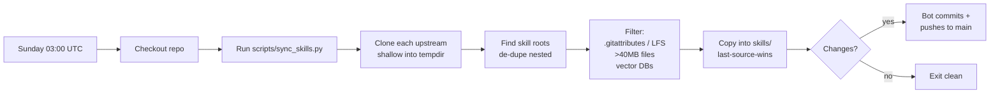

<div align="center">

# 🧬 awesome-skills

**A curated, auto-synced collection of 1,900+ agent skills for Claude Code and Codex CLI** — covering AI4Protein, bioinformatics, academic writing, and general dev/productivity workflows.

[](https://awesome.re)
[](LICENSE)
[](https://github.com/FridrichMethod/awesome-skills/actions/workflows/sync-skills.yml)
[](#sources)
[](#sources)
[](https://github.com/FridrichMethod/awesome-skills/commits/main)
[](CONTRIBUTING.md)

```bash
curl -fsSL https://raw.githubusercontent.com/FridrichMethod/awesome-skills/main/install.sh | bash
```

</div>

---

## Why this exists

Agent skills are how you give Claude Code or Codex CLI deep, reusable expertise in a domain — a folder with a `SKILL.md` and supporting scripts. The community has produced thousands of them across dozens of repos, each with their own scope, license, and quality bar.

**awesome-skills** does three things:

1. **Aggregates** the best Claude Code / Codex skills from 16 upstream curated collections — bio/scientific, academic writing, official Anthropic, Google DeepMind, Superpowers, Karpathy, and major community libraries.
2. **Filters** out things that break installs (Git LFS pointers, files >40 MB, bundled vector DBs, stale `.gitattributes`).
3. **Auto-syncs** every Sunday so your skill library stays current without manual work.

The result is one URL + one curl command that bootstraps a fresh laptop with **1,900+ vetted skills** ready for use in Claude Code or Codex.

---

## Contents

- [Quick install](#quick-install)
  - [Flags](#flags)
  - [Env overrides](#env-overrides)
  - [Common recipes](#common-recipes)
  - [From a local clone](#from-a-local-clone-rare)
- [Sources](#sources)
- [Highlights](#highlights)
  - [AI4Protein / structural biology](#ai4protein--structural-biology)
  - [Journal & paper writing](#journal--paper-writing)
- [Auto-sync workflow](#auto-sync-workflow)
- [Repo layout](#repo-layout)
- [Contributing](#contributing)
- [Security](#security)
- [Licensing](#licensing)
- [Acknowledgements](#acknowledgements)

---

## Quick install

```bash
curl -fsSL https://raw.githubusercontent.com/FridrichMethod/awesome-skills/main/install.sh | bash
```

The installer:

1. Downloads a tarball of this repo into a tempdir.
2. `rsync`s `skills/` into both `~/.claude/skills/` and `~/.codex/skills/`.
3. Cleans up the tempdir on exit. Nothing left on disk.

**Requirements:** `bash`, `curl`, `tar`, `rsync`. All four are standard on macOS and most Linux distros. On a fresh Debian/Ubuntu: `sudo apt-get install -y rsync`.

### Flags

```bash
curl -fsSL .../install.sh | bash -s -- --claude-only
```

| Flag | Effect |
|---|---|
| `--claude-only` | install only into `~/.claude/skills` |
| `--codex-only`  | install only into `~/.codex/skills` |
| `--dry-run`     | preview what would change without writing |
| `--delete`      | mirror exactly — remove local skills not in the repo |
| `-h`, `--help`  | print usage |

### Env overrides

| Variable | Default | Effect |
|---|---|---|
| `SKILLS_BRANCH` | `main` | install from a different branch |
| `SKILLS_CLAUDE_DEST` | `$HOME/.claude/skills` | override Claude install path |
| `SKILLS_CODEX_DEST` | `$HOME/.codex/skills` | override Codex install path |

> [!IMPORTANT]
> When using `curl … | bash`, env vars must be set on `bash`, **not** on `curl`. Either `export` them first or place them on the pipe's right side:
>
> ```bash
> # ✓ works
> export SKILLS_CLAUDE_DEST=/custom/claude
> curl -fsSL .../install.sh | bash
>
> # ✓ also works
> curl -fsSL .../install.sh | SKILLS_CLAUDE_DEST=/custom/claude bash
>
> # ✗ silently ignored — only curl sees the var
> SKILLS_CLAUDE_DEST=/custom/claude curl -fsSL .../install.sh | bash
> ```

### Common recipes

```bash
# Preview only — no files written
curl -fsSL https://raw.githubusercontent.com/FridrichMethod/awesome-skills/main/install.sh \
  | bash -s -- --dry-run

# Mirror exactly (remove local skills that aren't in the repo)
curl -fsSL https://raw.githubusercontent.com/FridrichMethod/awesome-skills/main/install.sh \
  | bash -s -- --delete

# Install only Codex skills, into a custom dir
export SKILLS_CODEX_DEST=/opt/agents/codex/skills
curl -fsSL https://raw.githubusercontent.com/FridrichMethod/awesome-skills/main/install.sh \
  | bash -s -- --codex-only

# Shell alias for periodic refresh
alias sync-skills='curl -fsSL https://raw.githubusercontent.com/FridrichMethod/awesome-skills/main/install.sh | bash'
```

### From a local clone (rare)

If you already have the repo cloned, `./install.sh` detects the adjacent `skills/` directory and skips the download.

---

## Sources

Skills are aggregated from these upstream repositories — credit and gratitude to the original authors. Sources are grouped by scope; within `scripts/sync_skills.py` they are listed in install order (later = wins on name collision). Currently **16 sources**.

### Bio / scientific / medical

| Source | Stars | Skills | Focus |
|---|---:|---:|---|
| [K-Dense-AI/claude-scientific-skills](https://github.com/K-Dense-AI/claude-scientific-skills) | 23.4k | ~137 | Scientific computing, bioinformatics, cheminformatics |
| [K-Dense-AI/claude-scientific-writer](https://github.com/K-Dense-AI/claude-scientific-writer) | 1.8k | ~81 | Scientific writing, citations, posters |
| [google-deepmind/science-skills](https://github.com/google-deepmind/science-skills) | 1.8k | 37 | **Google DeepMind** curated science skills — genomics, structural biology, cheminformatics, literature search, biological databases (Apache 2.0) |
| [FreedomIntelligence/OpenClaw-Medical-Skills](https://github.com/FreedomIntelligence/OpenClaw-Medical-Skills) | 2.5k | ~868 | Medical AI, clinical genomics, drug discovery |
| [GPTomics/bioSkills](https://github.com/GPTomics/bioSkills) | 667 | ~475 | Bioinformatics (variant, CRISPR, single-cell, spatial) |
| [jaechang-hits/SciAgent-Skills](https://github.com/jaechang-hits/SciAgent-Skills) | 158 | 199 | Life-science workflows (BixBench 92%) |
| [adaptyvbio/protein-design-skills](https://github.com/adaptyvbio/protein-design-skills) | 127 | 21 | **Protein design pipeline**: BoltzGen, Chai, RFdiffusion, ProteinMPNN |

### Academic / writing

| Source | Stars | Skills | Focus |
|---|---:|---:|---|
| [Imbad0202/academic-research-skills](https://github.com/Imbad0202/academic-research-skills) | 8.6k | 4 | Academic research→write→review pipeline |
| [lishix520/academic-paper-skills](https://github.com/lishix520/academic-paper-skills) | 624 | 2 | Paper strategist + composer |
| [jamditis/claude-skills-journalism](https://github.com/jamditis/claude-skills-journalism) | 209 | 53 | Journalism, FOIA, fact-checking, academic writing |
| [Yuan1z0825/nature-skills](https://github.com/Yuan1z0825/nature-skills) | 13k | 9 | **Nature journal** writing, polishing, figures, citations, peer-review response |

### General-purpose & foundational

| Source | Stars | Skills | Focus |
|---|---:|---:|---|
| [wshobson/agents](https://github.com/wshobson/agents) | 35.5k | 155 | Production dev workflows — accessibility, code review, deployment, testing across many plugin domains |
| [anthropics/claude-plugins-official](https://github.com/anthropics/claude-plugins-official) | 19.5k | 28 | **Official Anthropic** plugin skills — Discord, iMessage, Slack, Telegram, GitHub messaging & access |
| [forrestchang/andrej-karpathy-skills](https://github.com/forrestchang/andrej-karpathy-skills) | 133.3k | 1 | Andrej Karpathy's CLAUDE.md packaged — guidance for fixing common LLM coding pitfalls |
| [anthropics/skills](https://github.com/anthropics/skills) | 136.1k | 18 | **Official Anthropic** skills — algorithmic-art, brand-guidelines, canvas-design, claude-api, doc-coauthoring, mcp-builder, pdf, pptx, xlsx, etc. |
| [obra/superpowers](https://github.com/obra/superpowers) | 194.6k | 14 | Anthropic-blessed methodology framework — brainstorming, TDD, debugging, planning, code review, subagent-driven dev |

> On name collision, **later sources in the install order overwrite earlier ones**. The order in `scripts/sync_skills.py` places specialized protein-design and academic-writing skills last so they win conflicts.

---

## Highlights

### AI4Protein / structural biology

<details open>
<summary><strong>Click to expand</strong></summary>

| Category | Skills |
|---|---|
| **Generation / design** | `boltzgen` · `rfdiffusion` · `proteinmpnn` · `ligandmpnn` · `solublempnn` · `bindcraft` · `binder-design` · `generative-design` |
| **Structure prediction** | `alphafold` · `alphafold-predictions` · `chai` · `boltz` · `foldseek` · `modern-structure-prediction` · `protein-structure-prediction` |
| **Language models** | `esm` · `esm-protein-language-model` |
| **QC / validation** | `protein-qc` · `pose-validation` · `protein-design-workflow` · `binding-characterization` |
| **Antibody / therapeutics** | `antibody-design-agent` · `mage-antibody-generator` · `tooluniverse-antibody-engineering` · `tooluniverse-protein-therapeutic-design` |
| **Databases** | `uniprot-database` · `alphafold-database` · `pdb-database` · `chembl-database` · `drugbank-database` · `interpro-database` · `pubchem-database` |

</details>

### Journal & paper writing

<details open>
<summary><strong>Click to expand</strong></summary>

| Category | Skills |
|---|---|
| **Pipelines** | `academic-paper` · `academic-paper-reviewer` · `academic-pipeline` · `deep-research-swarm` · `composer` · `strategist` |
| **Drafting** | `scientific-writing` · `scientific-manuscript-writing` · `academic-writing` · `article-writing` · `peer-review-methodology` |
| **Citation / lit search** | `pubmed-database` · `biorxiv-database` · `medrxiv-search` · `literature-review` · `citation-management` · `paperzilla` |
| **Figures** | `latex-posters` · `latex-research-posters` · `scientific-schematics` · `scientific-visualization` · `markdown-mermaid-writing` · `pptx-posters` |
| **Venue figure guides** | `nature-figure-guide` · `cell-figure-guide` · `science-figure-guide` · `lancet-figure-guide` · `nejm-figure-guide` · `pnas-figure-guide` · `elife-figure-guide` · `cancer-research-figure-guide` |
| **Nature journal** | `nature-figure` · `nature-polishing` · `nature-writing` · `nature-citation` · `nature-data` · `nature-reader` · `nature-response` · `nature-paper2ppt` · `nature-academic-search` |

</details>

---

## Auto-sync workflow

A weekly GitHub Actions workflow ([`.github/workflows/sync-skills.yml`](.github/workflows/sync-skills.yml)) keeps the repo current:



**Trigger it manually:**

```bash
gh workflow run sync-skills.yml -R FridrichMethod/awesome-skills
```

Or via the [Actions tab](https://github.com/FridrichMethod/awesome-skills/actions/workflows/sync-skills.yml) → **Run workflow**.

Each successful run posts a per-source change summary table in the job summary.

---

## Repo layout

```
awesome-skills/
├── skills/                          ← 1,973 skill dirs (managed by sync; do not edit directly)
├── install.sh                       ← one-line installer (curl|bash compatible)
├── scripts/
│   └── sync_skills.py               ← aggregation logic
├── .github/
│   ├── workflows/sync-skills.yml    ← weekly auto-sync
│   ├── ISSUE_TEMPLATE/              ← new-source · broken-skill · installer-bug
│   ├── PULL_REQUEST_TEMPLATE.md
│   └── dependabot.yml
├── README.md
├── CONTRIBUTING.md
├── CODE_OF_CONDUCT.md
├── SECURITY.md
├── CHANGELOG.md
├── LICENSE
├── .pre-commit-config.yaml
└── .editorconfig
```

---

## Contributing

PRs, issue reports, and source suggestions are all welcome. **Don't edit files inside `skills/` directly** — those are managed by the weekly sync. See [CONTRIBUTING.md](CONTRIBUTING.md) for the full workflow, including how to:

- Suggest a new upstream source ([template](.github/ISSUE_TEMPLATE/new-source.yml))
- Report a broken skill ([template](.github/ISSUE_TEMPLATE/broken-skill.yml))
- Report an installer / workflow bug ([template](.github/ISSUE_TEMPLATE/installer-bug.yml))
- Test the installer and sync script locally

Setup hooks once:

```bash
pip install pre-commit && pre-commit install
```

---

## Security

Found a vulnerability in the installer, sync script, or workflows? Please disclose privately via [GitHub Security Advisories](https://github.com/FridrichMethod/awesome-skills/security/advisories/new) — see [SECURITY.md](SECURITY.md).

Vulnerabilities in *upstream skill content* should be reported to the source repo (see the [Sources](#sources) table).

---

## Licensing

The curation, installer, and workflows in this repo are released under the [MIT License](LICENSE).

**Skill content inside `skills/` retains its upstream license.** Each `skills/<name>/` directory may carry its own `LICENSE`, `README.md`, or inline notice from the original author. Review them before commercial reuse.

---

## Acknowledgements

This project would not exist without the work of:

**Bio / scientific / medical**

- [K-Dense AI](https://github.com/K-Dense-AI) for the scientific-skills + scientific-writer collections
- [FreedomIntelligence](https://github.com/FreedomIntelligence) for OpenClaw Medical Skills
- [GPTomics](https://github.com/GPTomics) for bioSkills
- [Jaechang Hits](https://github.com/jaechang-hits) for SciAgent-Skills
- [Google DeepMind](https://github.com/google-deepmind) for [science-skills](https://github.com/google-deepmind/science-skills) — genomics, structural biology, cheminformatics, literature search, and biological-database skills
- [Adaptyv Bio](https://github.com/adaptyvbio) for the protein-design pipeline skills

**Academic / writing**

- [Imbad0202](https://github.com/Imbad0202) and [lishix520](https://github.com/lishix520) for the academic paper pipelines
- [Yuan1z0825](https://github.com/Yuan1z0825) for [nature-skills](https://github.com/Yuan1z0825/nature-skills) — Nature journal writing, polishing, figures, citations, and peer-review response
- [Joe Amditis](https://github.com/jamditis) for the journalism skills

**General-purpose / foundational**

- [Jesse Vincent (obra)](https://github.com/obra) for [Superpowers](https://github.com/obra/superpowers) — the methodology framework that anchors how skills get built
- [Anthropic](https://github.com/anthropics) for the [official skills](https://github.com/anthropics/skills) and [plugins-official](https://github.com/anthropics/claude-plugins-official) directories
- [Andrej Karpathy](https://karpathy.ai/) (via [forrestchang](https://github.com/forrestchang/andrej-karpathy-skills)) for the famous CLAUDE.md
- [wshobson](https://github.com/wshobson) for the [agents](https://github.com/wshobson/agents) multi-plugin collection
- The [Anthropic Claude Code](https://docs.claude.com/en/docs/claude-code) team for designing the SKILL.md format

If you use this repo and find it useful, ⭐ the upstream sources, not just this one.

<p align="right"><a href="#-awesome-skills">↑ back to top</a></p>
